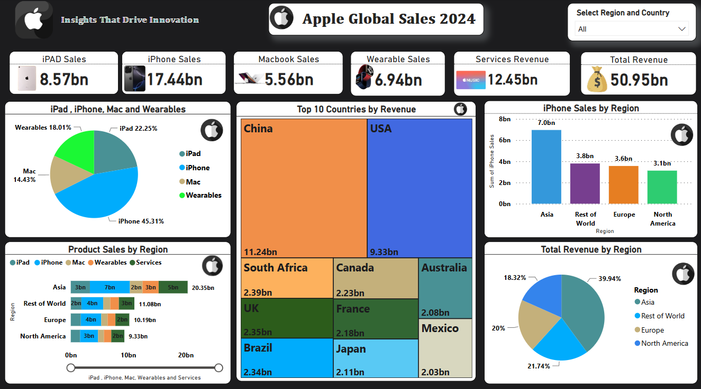

# 📊 Apple Global Sales Dashboard 2024  

This project is a **Power BI dashboard** that visualizes **Apple's global sales data for 2024**. It provides insights into **revenue, product sales, and regional distribution**, offering an interactive way to explore Apple's market performance.

---

## 📌 Features  

✅ **Total Revenue Analysis** - Displays overall revenue across different regions.  
✅ **Product Sales Breakdown** - Highlights individual product sales.  
✅ **Regional Sales Distribution** - Interactive map showing revenue by country.  
✅ **Top N Countries** - Ranks countries based on total revenue.  
✅ **Hierarchical Drill-Down** - Region-wise drill-down to country-level sales.

---

## 🛠️ Data Cleaning Instructions  

Before using the dataset in Power BI, the following cleaning steps are required:  

1️⃣ **Convert State Names to Countries**  
   - Replace state names with their respective country names.  
   - Example: Convert "California" to "USA".  

2️⃣ **Adjust Product Sales Units**  
   - Sales figures are in **millions**, but values in the dataset are raw.  
   - Multiply each sales value by **1,000,000**.  

3️⃣ **Ensure Consistent Formatting**  
   - Standardize numerical formats for revenue.  
   - Convert large numbers (e.g., 5,000,000,000) into **billions (5B)** for better readability.  

---

## Dashboard Template

## 🚀 How to Use  

1️⃣ Open the Power BI file (`Apple_sales_2024.pbix`).  
2️⃣ Connect the cleaned dataset.  
3️⃣ Explore **visualizations & insights** interactively.  

---

🔗 **Connect with Me**: www.linkedin.com/in/aditya-roundhal

  

