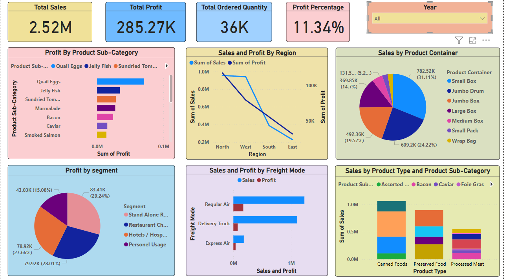

# 📊 Sales & Profit Analysis Dashboard

## Overview
This Power BI dashboard provides a comprehensive analysis of sales and profit trends across different product categories, regions, and other key business segments. It enables data-driven decision-making by offering interactive visualizations and key insights.

## 📌 Key Features
- **Total Sales & Profit Overview** 📈
- **Profit by Product Sub-Category** 🏷️
- **Sales & Profit by Region** 🌍
- **Sales Distribution by Product Container** 📦
- **Profit Breakdown by Segment** 🔍
- **Sales & Profit by Freight Mode** 🚚
- **Sales & Profit by Product Type & Sub-Category** 🍽️

## 🔹 Technologies Used
- **Power BI** – Data visualization & dashboarding
- **SQL** – Data querying & transformation (if applicable)
- **Excel/CSV** – Data source processing

## 📊 Insights Gained
- Identified the most profitable product categories
- Analyzed regional sales trends
- Evaluated the effectiveness of different freight modes
- Assessed customer segment profitability

## 📁 Dataset
- The dataset contains sales records from **2010 to 2013**.
- Features include product details, sales, profit, region, freight mode, and more.

## 📷 Dashboard Preview

## 🚀 How to Use
1. Open the **.pbix** file in Power BI.
2. Explore different filters and visualizations.
3. Gain insights and make data-driven decisions!

## 📢 Connect with Me
If you have any feedback or suggestions, feel free to reach out or connect with me on **LinkedIn**.
LinkedIn: www.linkedin.com/in/aditya-roundhal

